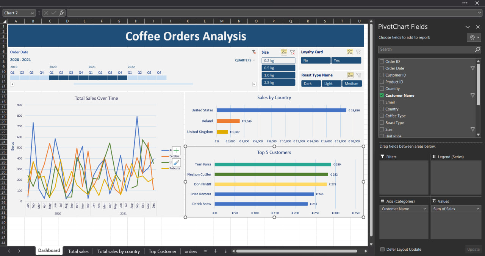

# Excel Coffee Product Analytics
The purpose of this project is to conduct analysis of various coffee products, their sales, and different coffee offerings, taking into account insights into their types, roast levels, sizes, pricing, and profitability.

The dataset was taken from https://www.kaggle.com/datasets/mohammadkaiftahir/coffee-orders-data

### Key learnings
* Data gathering
* Data transformation
* XLOOKUP
* INDEX and MATCH for simultaneous column and row mathing
* Usage of Pivot Tables and Pivot Charts
* Timeline and Slicers
* Creation of an interactive coffee sales dashboard

### Dashboard
