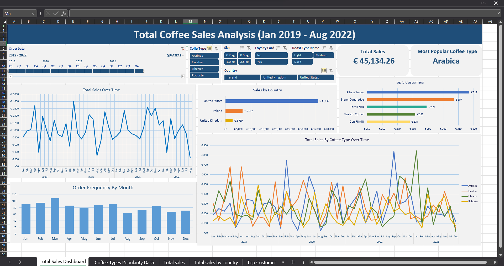
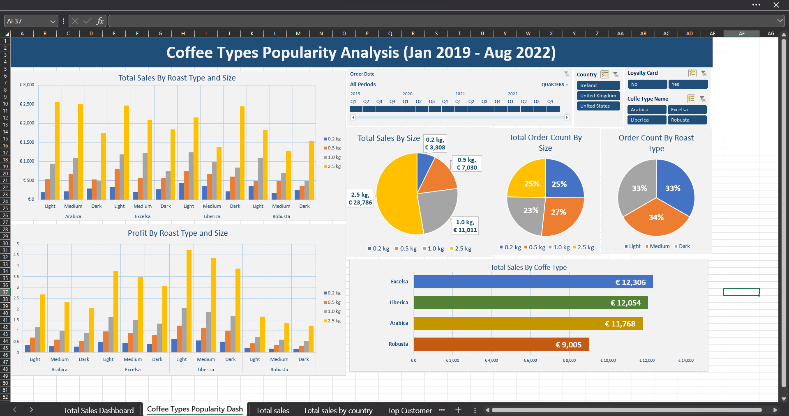

# Excel Coffee Product Analytics
The purpose of this project is to conduct analysis of various coffee products, their sales, and different coffee offerings, taking into account insights into their types, roast levels, sizes, pricing, and profitability.

The dataset was taken from https://www.kaggle.com/datasets/mohammadkaiftahir/coffee-orders-data

### Key learnings
* Data gathering
* Data transformation
* XLOOKUP
* INDEX and MATCH for simultaneous column and row mathing
* Using Pivot Tables and Pivot Charts
* Timeline and Slicers
* Creating an interactive coffee sales dashboard
* Creating a PowerPoint presentation 

#### The presentation with insights and recommendations you can find in the [Coffee Orders Analysis.pdf](./Coffee%20Orders%20Analysis.pdf) file

### Dashboards

